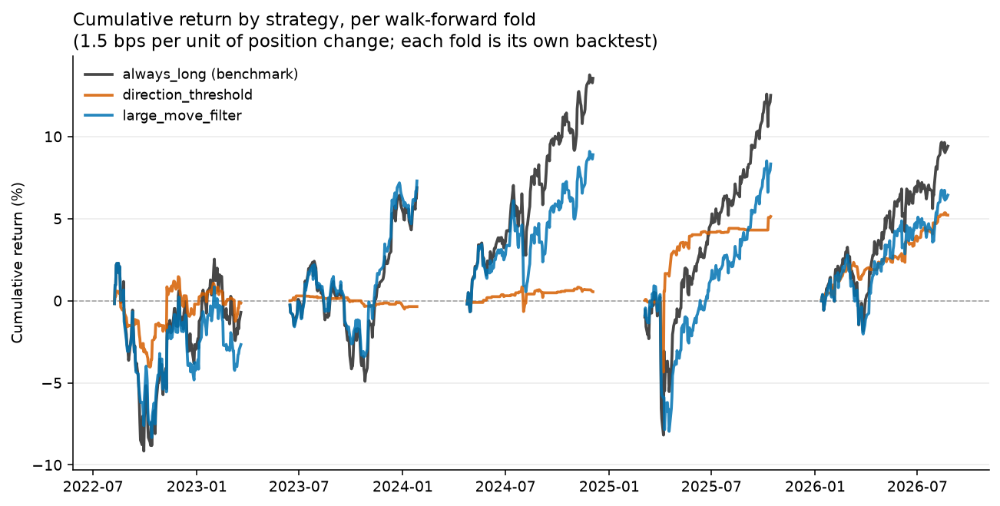
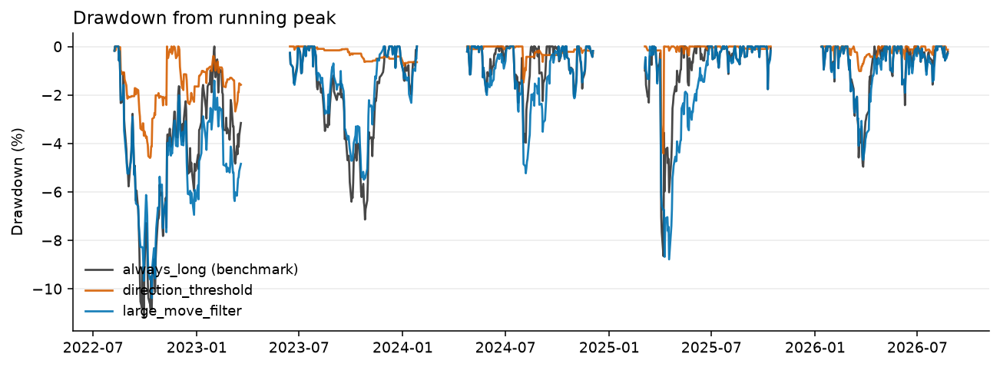
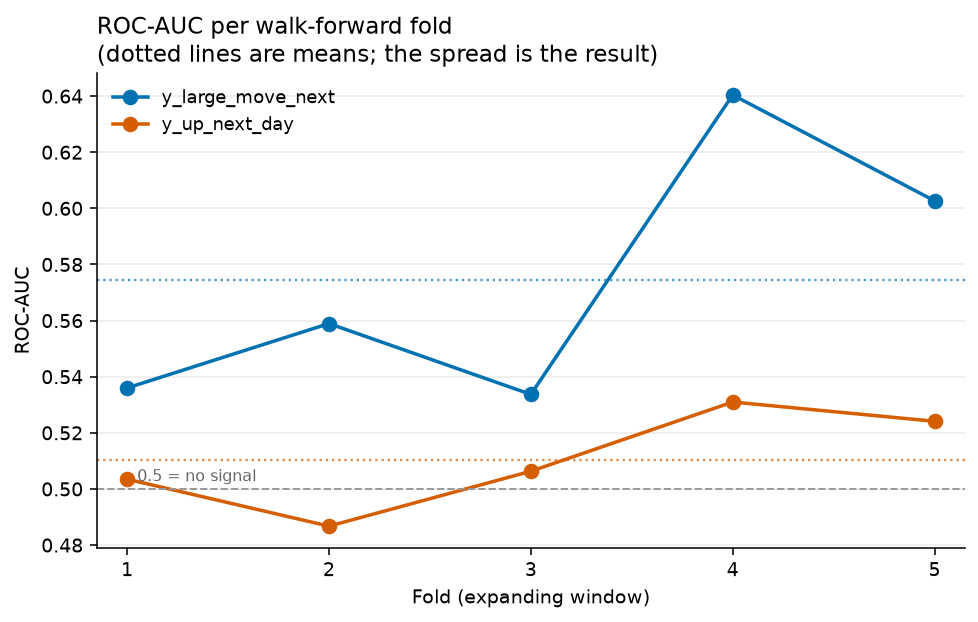
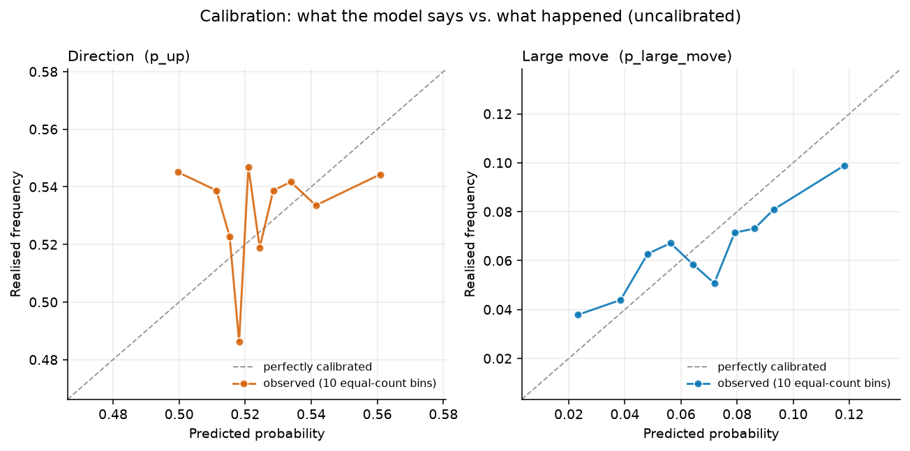

# EDMP Engine

**Event-Driven Market Probability Engine** is a reproducible research pipeline that estimates the
probability of next-day market moves, validates that estimate under conditions that do not flatter
it, and reports the honest conclusion: **the model has no tradeable edge.**

Building something that can tell you it failed is the point. Most of the engineering here exists
to make that verdict trustworthy.

**On the name: the event layer is not built yet.** This is the price-only baseline, deliberately
finished and evaluated first. Events are meant to arrive from a separate agent system that extracts
structured, timestamped facts from FOMC statements and macro releases, but an event feature is only
worth something if you can measure what it adds, and that needs an honest baseline to measure
against. This is that baseline. See [Phase E](#planned-extensions) for the plan and what it has to
beat.


---

## The result

Walk-forward validation across 5 expanding folds with a 60-day embargo, then a backtest with
transaction costs (1.5 bps per unit turnover), benchmarked against simply holding the market.

All three rules are tested on the same days, using the same predictions and the same costs. Only
the position rule changes, so every difference in the table below comes from the rule itself:

- **`always_long`** holds every asset every day. The benchmark, and the thing to beat. Note this
  is not "buy and hold since 2018": it holds the same 15 ETFs on exactly the days the model made
  predictions for, so the comparison is like for like.
- **`direction_threshold`** is a *directional bet*: go long when the model says `p_up > 0.55`,
  short when `p_up < 0.45`, flat in between. This is the rule the roadmap set out to test.
- **`large_move_filter`** is a *risk filter*, not a forecast: hold the market normally, but step
  aside to cash whenever `p_large_move > 0.10`. It never takes a view on which *way* the market
  moves, only on whether tomorrow looks turbulent. It exists because it is the only rule built on
  the signal the model actually has.

| Strategy | Sharpe | Total return | Max drawdown | Trades | vs. benchmark |
| --- | --- | --- | --- | --- | --- |
| `always_long` *(benchmark)* | **1.48** | 8.3% | −7.2% | 75 | — |
| `direction_threshold` | 0.66 | 2.1% | −2.5% | 1,221 | −0.82 Sharpe |
| `large_move_filter` | 1.22 | 5.7% | −6.9% | 898 | −0.26 Sharpe |



Each fold is a separate backtest; the gaps are embargo periods. `direction_threshold` trades 1,221
times to underperform doing nothing, which is what a 0.51 ROC-AUC looks like once it meets
transaction costs.



Its shallow drawdown is not risk management, it is being out of the market: the orange line sits
near zero because the strategy is flat most days, not because it is protecting capital.



Direction (`y_up_next_day`) lands above 0.5 in some folds and below it in others: no signal. That
is the expected result here. Every feature is derived from past prices, and in markets this large
and liquid, past prices are not supposed to predict tomorrow's direction (weak-form efficiency).

Large moves (`y_large_move_next`) hold a real but modest edge at ~0.57. Two things make that
believable. It shows up in 14 of the 15 ETFs individually, so the average is not one lucky
instrument dragging up fourteen flat ones. And it has a known cause: volatility clusters. 
A turbulent day tends to be followed by another turbulent day, which is one of the most
consistently documented properties of financial markets. It also survives where a directional edge
would not: a reliable direction signal would be close to free money, so traders would pile into it
until it stopped working. Knowing only that a big move is coming, without knowing which way, is
far harder to profit from, so nothing forces the pattern to disappear.

**The most useful finding came from the backtest, not the AUC.** `large_move_filter` uses the one
signal that genuinely exists, and still loses. `y_large_move_next` is *unsigned*: it knows a big
move is coming but not which way, so stepping aside forgoes as much upside as downside. Being
right about volatility is not the same as having an edge, and no amount of AUC would have shown
that.

**Calibration** 



**How to read it:** sort every prediction by what the model said, split into 10 equal groups, and
plot what the model predicted (across) against what actually happened (up). An honest model lands
on the dotted line: when it says 60%, the thing happens 60% of the time.

**Direction (left): the model just repeats the average.** Its predictions run only from 0.50 to
0.56, and 88% of them fall between 0.500 and 0.550. Up days happen 52.9% of the time; the model
predicts 52.3%. It has learned the base rate and nothing else. The line looks erratic only because
the vertical axis spans six percentage points; on a 0-to-1 axis it would be flat.

**Large moves (right): the model sorts days correctly but exaggerates how different they are.**
The line rises, so days it rates higher really do see more large moves. But it is flatter than the
dotted line, and that gap is the problem. Compare the two ends:

| | model predicted | actually happened |
| --- | --- | --- |
| calmest tenth of days | 2.3% | 3.8% |
| most turbulent tenth | 11.8% | 9.9% |
| **ratio between them** | **5.1x** | **2.6x** |

The model claims its worst days are five times riskier than its best days. They were only 2.6
times riskier. It picked the right order and overstated the gap by roughly a factor of two.

**Why the 0.57 ROC-AUC survives this.** ROC-AUC asks one question: given a day that had a large
move and a day that did not, does the model give the large-move day the higher number? It reads
the *order* and never the value, so halving every prediction, or squashing them all toward the
average, would leave it unchanged. A model can rank well and still print wrong numbers, which is
exactly what this one does.

**Why the numbers still cannot size a position.** Sizing means turning a probability into an
amount of money. Size for 12% when the truth is 10% and you have taken about 20% more risk than
you intended, and the error is systematic rather than random: it is always an overstatement at the
top end, which is where you would be betting most.

A threshold rule escapes this. `large_move_filter` asks only whether `p_large_move` is above 0.10,
which is a yes-or-no decision rather than an amount. It just needs the days above the line to be
the riskier ones, and they are: 115 large moves in the top tenth against 44 in the bottom. Whether
the true probability is 11.8% or 9.9%, you sit out either way.

A sizing rule cannot escape it, because the number becomes a multiplier on your money. The model
says its riskiest days are 5.1 times worse than its calmest; they were 2.6 times worse. Size by
that and you bet twice what the evidence supports, on the days where being wrong costs most.

**So a threshold rule needs the ranking to be right, and a sizing rule needs the value to be
right.** This model has the first and not the second, which is why `large_move_filter` is a
legitimate strategy to run and sizing a bet on `p_large_move` is not.

**Next step:** fit a calibrator (Platt or isotonic) inside each fold, on training rows only. It
squeezes predictions toward the true 6.5% base rate without changing their order, so the AUC is
unaffected and the probabilities become usable.

---

## What this project demonstrates

- **Honest evaluation.** Every strategy scored against a hold-the-market benchmark, a naive
  majority-class baseline reported alongside accuracy, and results published when they are
  negative.
- **Point-in-time correctness enforced structurally, not by convention.** Features may only use
  data at or before `t` (trailing-only window frames), and forward-looking values live in a
  separate table. `sql/90_assertions.sql` then recomputes each stored value independently from its
  definition and checks the two match: `ret_fwd_1d` on day *t* must equal `ret_1d` on day *t+1*,
  because both are `close(t+1)/close(t) − 1`. A shifted `LEAD`, or a window frame that lost its
  `PARTITION BY`, makes the two numbers differ and fails the build.
- **Time-series validation done properly.** Walk-forward expanding folds, never a random split,
  with a 60-day purge/embargo matched to the longest feature lookback so no test row's rolling
  window reaches into training data.
- **Testing aimed at silent failure**, which is the failure mode that matters in a data pipeline:
  36 pytest cases plus database-level invariants, each verified to fail by deliberately breaking it.
- **A real bug caught by that discipline.** A concurrency bug gave all 15 tickers one ticker's
  prices. Every test passed and every assertion passed, because a duplicated series is internally
  consistent, and it inflated large-move AUC to 0.67. It was found by noticing that a Treasury
  fund and an energy fund reported identical volatility to five decimal places. The fix and the
  cross-asset check that now prevents it are in [docs/design_decisions.md](docs/design_decisions.md) §9.

---

## Quick start

```bash
python3 -m venv .venv && source .venv/bin/activate && pip install -r requirements.txt
createdb edmp_engine

make run              # deterministic full rebuild: schema → load → validate → features → labels
make test             # 36 pytest cases, then post-pipeline SQL assertions
make train_baseline   # walk-forward training + honest evaluation
make backtest         # predictions → positions → costs → Sharpe, drawdown, expectancy
make charts           # regenerate docs/img/*.png from the warehouse
```

---

## Documentation

| Document | What it covers |
| --- | --- |
| [docs/design_decisions.md](docs/design_decisions.md) | **Read this first.** Why the system is built this way: architecture, validation discipline, testing strategy, measured results, honest limitations, and decisions deliberately deferred. |
| [docs/course_validation_and_backtesting.md](docs/course_validation_and_backtesting.md) | The concepts behind walk-forward validation and backtesting, written against this project's real tables. |
| [docs/course_calibration_and_events.md](docs/course_calibration_and_events.md) | Probability calibration and the event work ahead: alignment, surprise vs. level, and multiple-comparisons discipline. |
| [CLAUDE.md](CLAUDE.md) | Conventions and constraints for modifying the code. |

---

# Architecture

Yahoo Finance (Python)  
↓  
CSV (data_raw/) + config/assets.csv  
↓  
PostgreSQL raw.*  
↓ *(`sql/10_validations.sql`, the fail-fast gate on raw input)*  
staging.*  
↓  
analytics.features_daily / analytics.labels_daily  
↓  
analytics.v_training_dataset  
↓  
analytics.model_runs / analytics.model_predictions (python/train_baseline_logreg.py)  
↓  
analytics.backtest_runs / analytics.backtest_results (python/backtest_from_predictions.py)  
↓  
docs/img/*.png (python/make_charts.py)

Orchestrated via Makefile and rebuildable from scratch. `make run` rebuilds the warehouse
deterministically through `v_training_dataset`; `train_baseline`, `backtest` and `charts` are
explicit separate steps, because each training run appends to the `model_runs` experiment log
rather than replacing it.

## Ingestion is concurrent

Fetching a ticker means an HTTP round-trip, and nearly all of that time is spent waiting on Yahoo
rather than computing. `python/prepare_data.py` therefore runs them concurrently: one `asyncio`
task per ticker inside a `TaskGroup`, with the blocking fetch handed to a worker thread via
`asyncio.to_thread` so the event loop can start the next one. An `asyncio.Semaphore` caps
in-flight requests at `MAX_CONCURRENT_DOWNLOADS = 20`, because Yahoo's rate limits are informal
and unbounded fan-out gets throttled.

At 15 tickers this is a convenience. It is built this way for the universe this project is headed
toward: the Phase E corporate vertical needs individual equities, and a few hundred symbols
fetched one at a time turns a rebuild from seconds into minutes, which is enough friction to stop
people rebuilding from scratch. That would cost more than the download time, since rebuilding
freely is the property the rest of the pipeline depends on.

The decision also introduced two failure modes, both silent, and both now guarded in
`sql/10_validations.sql`:

**One ticker's failure must not abort the batch**, so each fetch is wrapped in its own
`try`/`except`. The cost is that a failed download becomes a warning on stdout and an otherwise
successful build, with one asset simply absent from the warehouse. No per-row check can see this,
because the problem is a row that does not exist. Hence the validation that **every symbol in
`config/assets.csv` has at least one price row**.

**Concurrent calls to `yf.download()` corrupt each other.** It stages results in module-level
state (`yfinance.shared._DFS`) and resets that on entry, so two calls in flight overwrite each
other's accumulator and callers can receive the same wrong ticker's frame. This is the bug
described below: every series stays internally consistent, so every per-asset assertion passes
while the warehouse holds one ticker's prices fifteen times. The fix is `yf.Ticker().history()`,
which keeps its result on the instance, and the guard is the validation that **no two symbols
share an identical price series**.

Both checks exist because concurrency made them necessary. Neither failure is possible in a
sequential loop, and neither is visible in any single asset's data, which is why they needed
cross-cutting assertions rather than per-row ones.

------------------------------------------------------------------------

# Tech Stack

-   PostgreSQL
-   Python (asyncio, yfinance, pandas, psycopg, scikit-learn, matplotlib)
-   SQL (window functions, rolling statistics, `DO $$` assertion blocks)
-   Make
-   pytest
-   Virtual environment (venv)

------------------------------------------------------------------------

# Setup

## 1. Clone the repository

```
git clone https://github.com/will13cb/edmp_engine.git
cd edmp_engine
```

## 2. Create Python virtual environment

```
python3 -m venv .venv 
source .venv/bin/activate
pip install -r requirements.txt
```

## 3. Create PostgreSQL database
Install and start PostgreSQL
macOS (Homebrew)
```
brew install postgresql
brew services start postgresql
```

Ubuntu / Debian
```
sudo apt update
sudo apt install postgresql postgresql-contrib
sudo service postgresql start
```

## 4. Create the database

createdb edmp_engine

## 5. Build Everything

```
make run
```

This will:

1.  Create schemas and tables
2.  Truncate raw tables
3.  Load CSV data
4.  Transform raw → staging
5.  Compute analytics features
6.  Compute forward labels

The system is deterministic and rebuildable.

## 6. Train the baseline model (optional)

```
make train_baseline
```

Trains a logistic regression on `analytics.v_training_dataset` (walk-forward folds, never a
random split) and writes predictions to `analytics.model_predictions`, tracked by a new row in
`analytics.model_runs` per fold. Not part of `make run`, because each invocation appends new
model runs rather than overwriting, so it's kept as a separate, explicit step. See "Implementation
Roadmap" below (Phase A) for details.

Note that `make run` **clears** these tables: they accumulate across training runs but reset
whenever the warehouse beneath them is rebuilt, because `model_predictions.asset_id` points into
a `staging.assets` table that is regenerated with new ids each time. Run training after a
rebuild, not before, and `pg_dump` the two tables first if a particular run has to outlive one
(`docs/design_decisions.md` §2).

------------------------------------------------------------------------

# Project Structure

```
EDMP_Engine/
├── config/
│   └── assets.csv  # the asset universe: tracked, hand-edited, loaded into raw.assets
├── data_raw/       # generated CSVs (ignored by git)
├── docs/
│   ├── img/            # generated charts (make charts)
│   ├── architecture/   # warehouse schema diagram (ERD source + SVG)
│   ├── design_decisions.md                    # why the system is built this way
│   ├── course_validation_and_backtesting.md   # concepts behind Phases B-D
│   └── course_calibration_and_events.md       # calibration + Phase E (events)
├── python/
│   ├── prepare_data.py
│   ├── train_baseline_logreg.py
│   ├── backtest_from_predictions.py
│   └── make_charts.py
├── sql/
│   ├── 00_schema.sql
│   ├── 10_validations.sql          # guards raw INPUT (fail-fast, pre-staging)
│   ├── 20_staging_transform.sql
│   ├── 30_analytics_features.sql
│   ├── 40_analytics_labels.sql
│   ├── 50_training_dataset.sql
│   └── 90_assertions.sql           # guards computed OUTPUT (run by `make test`)
├── tests/
│   ├── conftest.py
│   ├── test_folds.py               # fold / embargo invariants (pytest)
│   ├── test_ingestion.py           # only settled sessions may enter the warehouse
│   ├── test_evaluation.py          # per-symbol scoring; undefined-AUC handling
│   └── test_backtest.py            # cost, compounding, drawdown and hit-rate arithmetic
├── .claude/
│   ├── settings.json               # registers the PostToolUse hook
│   ├── hooks/comment_reminder.sh   # prompts for why-comments on .py/.sql edits
│   ├── skills/leakage-audit/       # on-demand temporal-leakage audit procedure
│   └── skills/doc-audit/           # checks a change is reflected in the docs, not just alongside them
├── Makefile
├── requirements.txt
├── README.md
└── .gitignore
```

------------------------------------------------------------------------

# Features Computed

From historical daily prices:

-   Daily return (ret_1d)
-   Log return (logret_1d)
-   Rolling 20-day volatility (vol_20d)
-   5-day momentum (mom_5d)
-   20-day momentum (mom_20d)
-   60-day drawdown (drawdown_60d)

------------------------------------------------------------------------

# Labels Generated

-   Forward 1-day return
-   Absolute forward return
-   y_up_next_day
-   y_large_move_next (volatility-scaled threshold)

------------------------------------------------------------------------

# Reproducibility

The pipeline is designed to:

-   Be fully rebuildable from zero
-   Avoid manual pgAdmin steps
-   Avoid hidden state
-   Use deterministic truncation before rebuild

To rebuild cleanly:

make run

------------------------------------------------------------------------

# Concept

The objective of this project is to estimate:  
P(market moves \| historical features + event context)

In practical terms:

The probability that the market moves, given past data and current event information.

Inputs:  
-   Historical features = past prices, returns, volatility, volume, technical indicators, etc.

-   Event context = news, earnings, speeches, macroeconomic announcements, or other real-world events.

Output:  
-   The model learns patterns from historical data and event-driven signals, and produces a probability estimate.  
For example:
0.63 → a 63% probability that the market moves up, given the chosen factors, not an absolute forecast of the market.

Interpretation:  
Markets incorporate vast and continuously evolving information. The model observes only a defined subset of that information. As a result, its output represents a conditional probability, not a deterministic prediction.
Financial markets are inherently stochastic systems influenced by noise, randomness, and unexpected events.  
Rather than asserting a direction, the model estimates how likely a move is, given the available feature set.

Probabilistic outputs allow for:
-   Rational decision-making
-   Risk management and position sizing
-   Expected value calculations
-   Operating optimally under uncertainty

In essence, the system evaluates whether the selected variables contain directional signal, without claiming to model the full complexity of market dynamics.

------------------------------------------------------------------------

# Time-Series Validation Protocol

This project uses strict temporal validation to prevent lookahead bias.

-   All features at time ( t ) are constructed exclusively from
    information available at or before ( t ).
-   Forward returns and classification labels are computed using ( t+1 )
    prices and stored separately.
-   Training and test datasets are split chronologically, not randomly.
-   The model is trained on historical data up to a cutoff date and
    evaluated on strictly future observations.

## Formal Definition

Features at time t:

X_t = f({ data_τ : τ ≤ t })

Label:

y_t = outcome_{t+1}

All features at time t are constructed using information available at or before t.
No future information is used in feature construction or model training.

------------------------------------------------------------------------

# Enforcing that protocol

The protocol above is only worth stating if something enforces it. Temporal leakage is a
*silent* failure: nothing crashes, no row count changes, and the only symptom is a metric that
quietly becomes optimistic. So the guarantees are mechanical rather than aspirational.

```bash
make test     # pytest (fast, no DB), then sql/90_assertions.sql (needs a built warehouse)
```

## Two validation layers, guarding opposite ends

| File | Guards | Runs |
| --- | --- | --- |
| `sql/10_validations.sql` | raw **input**: nulls, negative prices, `high < low`, duplicate keys, future dates, assets with no prices, identical series across symbols | inside `make run`, before staging |
| `sql/90_assertions.sql` | computed **output**: re-derives each value from its definition | `make test`, after the pipeline |

The strongest assertion is `ret_fwd_1d(t) == ret_1d(t+1)`. Both equal `close(t+1)/close(t) - 1`,
so a shifted `LEAD`/`LAG`, or a window frame missing its `PARTITION BY asset_id`, makes them
diverge. A second check enforces **in the database** that every `model_predictions` row falls
inside its run's test window, so "out-of-sample forecasts only" is structural rather than a
convention in Python that a later backtest could silently violate.

`tests/test_folds.py` covers the walk-forward logic, where an overlapping train/test window
would invalidate every metric while raising no error: no overlap, an embargo gap of exactly
`EMBARGO_DAYS` trading days, disjoint test blocks, and a genuinely expanding window.

**The assertions are verified to fail.** A suite that has never failed is unverified, so each
invariant was confirmed by deliberately breaking it and watching it fire. An assertion that
passes unconditionally is worse than none, because it licenses false confidence.

## What tests can't catch

Automated tests enforce the invariants someone already wrote down. They cannot catch a *novel*
mistake: a new feature that uses `LEAD`, or a `StandardScaler` moved outside the fold loop so it
learns its mean and standard deviation from test rows as well as training ones. The second is
invisible to every assertion here, because the scaler is an in-memory object that is never written
to the database, so nothing stored records which rows it learned from. Only reading the code finds
it. So the work is split across three mechanisms, each given only the job it is actually capable
of:

| Mechanism | What it can do | Used for |
| --- | --- | --- |
| `make test` | Mechanically enforce a written-down rule, every time | Invariants already understood |
| `.claude/skills/leakage-audit/` | Judge whether new code is *correct* | Leakage no assertion covers yet |
| `.claude/hooks/comment_reminder.sh` | *Prompt* on an edit, but never verify | Asking for the reasoning behind `.py`/`.sql` changes |

**Every audit finding becomes an assertion.** Otherwise the review checklist grows by one item
every time something is found, permanently, until it is too long to perform honestly. Encoding a
finding costs milliseconds per commit and removes it from the checklist entirely, which leaves the
audit free to look for things nobody has thought of yet.

`test_embargo_covers_the_longest_feature_lookback` is what that migration looks like. The rule it
protects: the embargo has to be at least as long as the longest feature lookback. `drawdown_60d`
looks back 60 days, so a test row sitting 10 days after a cutoff has 50 days of its window
computed from training-period prices, and `EMBARGO_DAYS = 60` exists to drop exactly those rows.
Add a longer feature, say `mom_120d`, and 60 stops being enough. Nothing crashes; the metrics just
quietly improve.

For a while the only defence was someone remembering to ask "did anyone raise `EMBARGO_DAYS`?"
during review. Now the test reads `FEATURE_COLUMNS`, pulls the lookback off the end of each name
(`mom_20d` gives 20, `drawdown_60d` gives 60), takes the largest, and asserts the embargo covers
it. Adding `mom_120d` fails the suite immediately, with a message saying to raise the embargo.

The detail that matters is that it derives the requirement from the feature list rather than
hardcoding `>= 60`. A hardcoded version would keep passing after someone adds a longer window,
which is the exact failure it was written to prevent.

**The one real bug so far was found by the audit, not the tests.** An ingestion fault left every
symbol holding a single ticker's prices. Eighteen pytest cases passed, all six SQL assertions
passed, row counts were right and no NULLs appeared, because a duplicated series satisfies every property
they check. The suite was green and the data was wrong. What caught it was a rule written into the
skill: *a suspiciously good result is a lead, not a win.* Large-move ROC-AUC had jumped to 0.67
against a recorded baseline near 0.59, and pulling on that turned up a Treasury fund and an energy
fund reporting identical volatility to five decimal places. Both new checks in
`sql/10_validations.sql` exist because of that audit.

Two practices from this generalise beyond the project. **Write the baseline number down.** "0.67
is suspicious" is only available to someone who recorded 0.59 first. And **don't ask a hook to do
a skill's job**: a hook can see that a file was touched, not whether what was written is true,
which is why documentation upkeep here is the `doc-audit` skill rather than a hook
(`docs/design_decisions.md` §11).

------------------------------------------------------------------------

# Planned extensions

Price ingestion, warehousing, features, time-safe labels, a baseline logistic regression
model (Phase A), walk-forward validation with embargo (Phase B), honest evaluation
(Phase C), and the backtest with costs and risk metrics (Phase D) are done. See
"Implementation Roadmap" below for the step-by-step plan and the status of each phase,
`docs/course_validation_and_backtesting.md` for the concepts behind Phases B–D, and
`docs/course_calibration_and_events.md` for calibration and the event work in Phase E.

**Next up: calibration**
- Fit a calibrator (Platt / isotonic) inside each fold, on the training rows only. Calibration
  is currently *measured* (`print_calibration`, and the reliability chart from `make charts`)
  but never *corrected*. The 0.55–0.60 bucket is overconfident, which is why `p_up` must not
  be used for proportional position sizing yet.

**Then: events (Phase E)**

The name of this project promises events and there are none in it yet. `raw.events` and
`staging.events` exist in the schema, `python/prepare_data.py` writes an empty but schema-valid
`events.csv`, and `staging.event_asset_map` is a placeholder that cross-joins every event to every
asset. That ordering is deliberate. An event feature is only worth something if you can measure
what it adds, and measuring that needs an honest baseline to compare against, so the price-only
pipeline had to be finished and evaluated first. That baseline now exists and it is unflattering:
direction sits at ~0.51 ROC-AUC, large moves at ~0.57, and no strategy built on either beats
holding the market. Any event feature has to move those numbers or it has not earned its place.

**The intended source is an agent system, not a purchased event calendar**: a separate project that
turns financial documents into structured, timestamped events. It has two verticals, and macro
comes first only because it needs nothing new from this warehouse.

- **Macro** (FOMC statements and minutes, Fed speeches, BLS/CPI releases) works on the 15 ETFs
  already here, with no new instruments. This is the vertical that plugs into Phase E directly,
  which is why it is first.
- **Corporate** (10-K, 10-Q, 8-K, Form 4, earnings releases) is planned too, and needs the
  universe extended to individual equities before it has anything to attach to. Same machinery,
  one more prerequisite.

FOMC statements are close to ideal as a starting point: short, published on a fixed schedule,
deliberately formulaic, and changed sparingly, so a word-level diff between consecutive statements
is genuinely informative. A structured hawkish/dovish delta per meeting would be a real event
feature on instruments the warehouse already holds.


The warehouse-side work, once events actually arrive:

- Macroeconomic event alignment logic (timezone/after-hours → effective trading date)
- Event → asset mapping rules (replace the `staging.event_asset_map` cross-join baseline)
- Event-conditional features (pre/post windows, surprise magnitude, sentiment proxies)

**Later:**
- Uncertainty estimates on predictions (confidence intervals via bootstrap / Bayesian logistic regression)
- Gradient-boosted trees (XGBoost/LightGBM) if event interaction terms exceed what logistic regression can capture
- **Live intraday data.** The pipeline is end-of-day batch: it ingests only settled sessions and
  deliberately drops the current, still-forming bar (see `docs/design_decisions.md` §11). The
  intended direction is to refresh the warehouse continuously, down to second-level updates,
  which is a different system rather than a bigger version of this one, since a forming bar is a
  value that keeps changing and every stored number would need to record *when* it was true.

------------------------------------------------------------------------

# Implementation Roadmap

## Phase A: Baseline model (logistic regression) [done]
- `python/train_baseline_logreg.py`: reads from `analytics.v_training_dataset`
- Chronological train/test split (`df[df.trading_date <= TRAIN_END]`), never random
- `StandardScaler` fit on train only, applied to both train and test
- `LogisticRegression` for both `y_up_next_day` and `y_large_move_next`
- Inserts one row into `analytics.model_runs`, many rows into `analytics.model_predictions`
- Run via `make train_baseline`. Evaluated with **ROC-AUC**: the probability that the
  model ranks a randomly chosen positive-class day (e.g. an "up" day) above a randomly
  chosen negative-class day, across all thresholds at once. `0.5` = coin flip / no signal,
  `1.0` = perfect separation. `docs/design_decisions.md` §7 builds the metric up properly:
  where the curve comes from, why it is immune to class imbalance (which matters for
  `y_large_move_next` at a ~6.7% base rate), and the three things it deliberately cannot tell you. First result (single 80/20 split, not yet walk-forward
  validated): test ROC-AUC 0.49 for `y_up_next_day` (no signal, expected for a hard,
  near-random-walk target), 0.60 for `y_large_move_next` (a real, if modest, edge from the
  volatility/drawdown features). Numbers from one split shouldn't be trusted yet, which is
  what Phase B is for.

## Phase B: Time-series validation [done]
- `python/train_baseline_logreg.py` now runs walk-forward (expanding-window) validation
  instead of a single split: 5 folds, each training on all history up to its cutoff and
  testing on the block after it. Each fold writes its own `analytics.model_runs` row.
- **Purging/embargo**: the first 60 trading days after each cutoff are dropped
  (`EMBARGO_DAYS`, matching the longest lookback `drawdown_60d`). Without this, test rows
  near the boundary have `vol_20d`/`mom_20d`/`drawdown_60d` values computed partly from
  training-period prices. Not full label leakage, but enough that adjacent rows aren't
  independent.
- A plain random split (sklearn's default) is invalid here, because adjacent rows share
  overlapping lookback windows.
- **Result** (5 folds): `y_up_next_day` ROC-AUC mean 0.4934, std 0.0279, range 0.46–0.53. The
  folds land on both sides of 0.5, confirming there is no directional signal and that Phase A's
  0.49 was not a one-off. `y_large_move_next` mean 0.5928, std 0.0636, range 0.52–0.68. The volatility
  edge holds up across every fold, though with meaningful fold-to-fold variance.

## Phase C: Evaluate honestly [done]
- Confusion matrix at `LONG_THRESHOLD` (0.55), calibration bucket table, and naive-baseline
  comparison print per fold. See `docs/course_validation_and_backtesting.md` section 3.
- **The naive baseline beats the model on accuracy in every fold** (e.g. fold 3: 0.5844
  naive vs 0.4156 model). The model almost never clears 0.55 (single-digit true positives
  per fold), so at that threshold it mostly abstains while ~53% of days are up anyway. This
  is the single most important honest-evaluation finding: beating 0.5 AUC and beating the
  naive baseline are not the same bar.
- **Calibration is poor in the upper buckets**: the 0.55–0.60 bucket realizes ~0.33–0.45
  rather than ~0.575, i.e. the model is overconfident exactly where it would trade. Phase D
  must not size positions proportional to `p_up` until this is fixed.

## Phase D: Backtest [done]
- `python/backtest_from_predictions.py`, run via `make backtest`. Reads stored out-of-sample
  predictions, joins them to the realised `ret_fwd_1d` they were a bet on, and writes summary
  metrics to `analytics.backtest_runs` with the daily series in `analytics.backtest_results`.
- Three position rules, each scored on identical predictions: `always_long` (the benchmark),
  `direction_threshold` (the stored `signal`: long above 0.55, short below 0.45), and
  `large_move_filter` (hold the market, step aside when `p_large_move` is high).
- Costs are charged on position *changes* at `--cost-bps` (default 1.5), including the entry from
  cash. `turnover` is stored per day so the deduction can be re-derived rather than trusted.
- Each fold is backtested separately: test blocks are separated by embargo gaps, so a single
  stitched equity curve would compound across periods the strategy was never invested in.
- **Result: neither strategy beats holding the market**, which is the finding:

  | Strategy | Sharpe | Total return | Max drawdown | vs. always_long |
  | --- | --- | --- | --- | --- |
  | `always_long` | 1.48 | 8.3% | −7.2% | — |
  | `direction_threshold` | 0.66 | 2.1% | −2.5% | −0.82 Sharpe |
  | `large_move_filter` | 1.22 | 5.7% | −6.9% | −0.26 Sharpe |

  `direction_threshold` losing is the expected consequence of a 0.51 ROC-AUC: it trades 1,221
  times to buy a lower return than doing nothing. `large_move_filter` is the more interesting
  failure, because it uses the one signal that does exist (~0.57 AUC), and stepping aside on
  predicted-large-move days shaved the drawdown by only 0.3 points while giving up 2.6 points of
  return. The label is unsigned, so avoiding a large move forgoes as much upside as downside.
  Being *right about volatility* is not the same as having an edge.

## Phase E: Events (only after Phases A–D produce a baseline)
- Ingest in order of ease: macro calendar (CPI/FOMC, quantifiable via `actual - forecast` surprise) → earnings (per-ticker mapping, after-hours handling) → speeches/text (NLP, sentiment proxy)
- Effective trading date alignment: map each event to pre-market / after-market / weekend → next tradable session
- Event-conditional features: days-since-last-event, event-day dummy variables, interaction terms (e.g. `mom_20d * is_fomc_day`)
- Multiple comparisons risk: hold out an event-feature test set, or apply a correction (e.g. Bonferroni), before trusting any single new event feature
- Replace the `staging.event_asset_map` cross-join placeholder with real event → asset mapping rules

## Phase F: Beyond logistic regression (later)
- If event interaction terms make the linear model insufficient, move to gradient-boosted trees (XGBoost/LightGBM), trading away the current clean coefficient interpretability for automatic interaction/nonlinearity handling

------------------------------------------------------------------------

# Notes

-   data_raw/ is ignored in Git
-   .venv/ is ignored in Git
-   PostgreSQL must be running locally
-   Designed for Linux / Ubuntu and macOS environments
